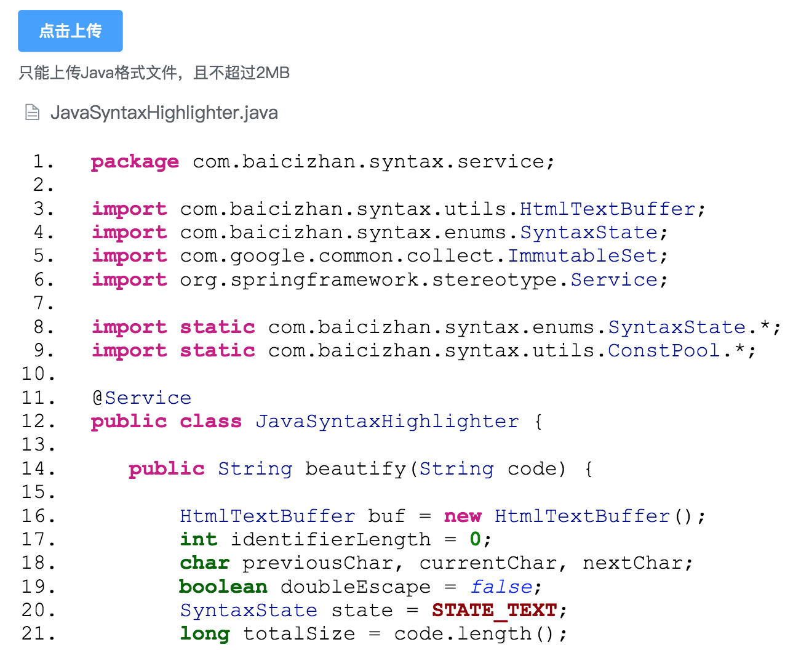

# 演示前后端分离的小型项目

场景：实现一个Java源代码语法高亮显示的web应用

（虽然共用代码仓库，前后端可独立运行和测试）

## 编译项目

前端使用`Vue`和`ElementUI`（基于[element-starter模板](https://github.com/ElementUI/element-starter)），需要Nodejs v6以上版本编译:

```bash
cd web
make prepare
make
```

生成的页面文件在`src/main/resources/static`目录。

后端使用`Spring Boot`和`Spring MVC`提供Java文本高亮服务。

回到项目根目录，使用Maven编译整个项目，同时打包生成的前端文件。然后运行:

```bash
mvn clean package
java -jar target/syntax-1.0.0-SNAPSHOT.jar
```

## 运行截图

浏览器访问`http://localhost:8000`地址，使用`点击上传`按钮选择一个本地的Java文件。

若选择的不是Java类型文件，或选择的文件超过2MB，将有提示信息。

加载后，文件内容会被高亮展示：


