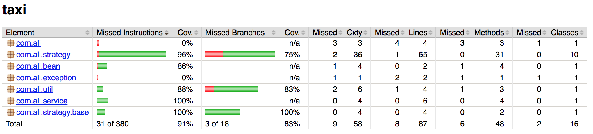

# 演示策略链模式和数据驱动测试

场景：出租车计费问题

## 场景描述

- 出租车起步价15元，含3公里
- 起步价之后，每公里3.5元
- 晚上11点之后（含），次日6点前（不含）起步价18元，含3公里
- 晚上起步价之后，每公里3元
- 10公里之后，白天每公里3.5元，晚上每公里4.7元
- 外环的出租车10公里之外的价格与10公里之内相同
- 设计跨地域或跨时间边界的问题，计费标准以起点为准。

## 设计说明

使用`IStrategy`接口表示一类情况下的计费规则，使用`StrategyChain`工具类组合规则链。属于策略模式的变种结构。

通过对各类策略进行分类组合的方式，确保架构的开放性和扩展性。

## 单元测试

运行单元测试并生成覆盖率报告：

```
mvn clean test
```

采用数据驱动方式减少重复的单元测试代码，整体测试覆盖率91%。



